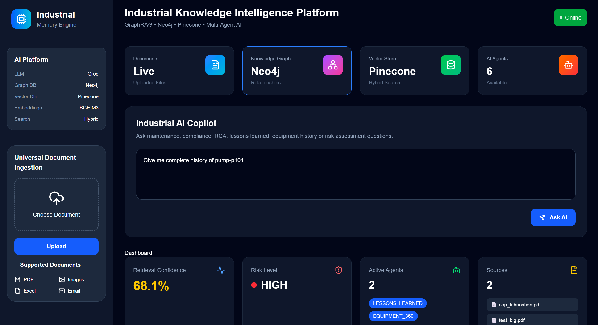
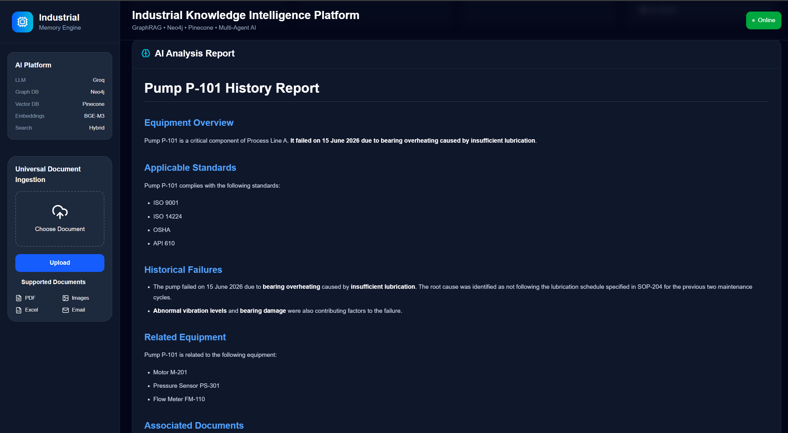
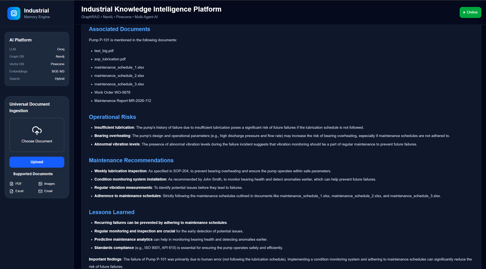
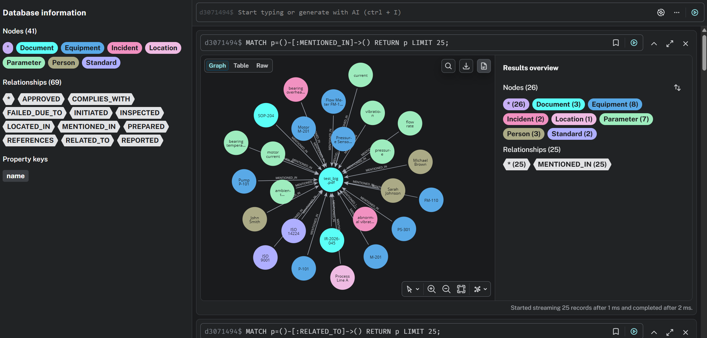

# Industrial Memory Engine

## Problem

Knowledge fragmentation and loss of operational expertise in industrial organizations.

## Solution

AI-powered memory graph that preserves operational knowledge and provides maintenance and compliance intelligence.

## Features

- Universal document ingestion
- Knowledge graph generation
- Lessons learned engine
- Knowledge cliff detection
- Failure pattern intelligence
- Industrial copilot

## Tech Stack

FastAPI
LangGraph
Neo4j
Pinecone
OpenAI
Next.js

## Architecture

                                   ┌─────────────────────────┐
                                   │      React Frontend     │
                                   │  Dashboard + AI Chat    │
                                   └────────────┬────────────┘
                                                │
                                  Upload / Chat │ REST API
                                                │
                                   ┌────────────▼────────────┐
                                   │     FastAPI Backend     │
                                   │    API Gateway Layer    │
                                   └───────┬────────┬────────┘
                                           │        │
                                 Upload API│        │Chat API
                                           │        │
                 ┌─────────────────────────┘        └────────────────────────┐
                 │                                                           │
      ┌──────────▼───────────┐                                  ┌────────────▼─────────────┐
      │ Universal Parser     │                                  │ Multi-Agent Orchestrator │
      │                      │                                  │                          │
      │ PDF Parser           │                                  │ Query Classification     │
      │ OCR Parser           │                                  │ Agent Selection          │
      │ Image Parser         │                                  │ Context Fusion           │
      │ Excel Parser         │                                  │ LLM Reasoning            │
      │ Email Parser         │                                  └────────────┬─────────────┘
      └──────────┬───────────┘                                               │
                 │                                                           │
                 ▼                                                           ▼
      ┌──────────────────────┐                           ┌─────────────────────────────┐
      │ Text Chunking        │                           │ Hybrid Retrieval            │
      │ Metadata Extraction  │                           │                             │
      └──────────┬───────────┘                           │ Vector Search               │
                 │                                       │ BM25 Search                 │
                 ▼                                       │ Graph Retrieval             │
      ┌────────────────────────┐                         └─────────────┬───────────────┘
      │ Entity Extraction LLM  │                                       │
      └──────────┬─────────────┘                                       │
                 │                                                     │
      ┌──────────▼─────────────┐                         ┌──────────────▼──────────────┐
      │ Knowledge Graph Builder│                         │ Pinecone Vector Database    │
      │                        │                         │ BGE-M3 Embeddings           │
      └──────────┬─────────────┘                         └─────────────────────────────┘
                 │
                 ▼
      ┌────────────────────────┐
      │ Neo4j Graph Database   │
      │ Entities               │
      │ Relationships          │
      └──────────┬─────────────┘
                 │
                 ▼
      ┌────────────────────────┐
      │ Groq Llama 3.3 70B LLM │
      │ Final Answer Generation│
      └──────────┬─────────────┘
                 │
                 ▼
          JSON Response

## Roadmap

In progress
