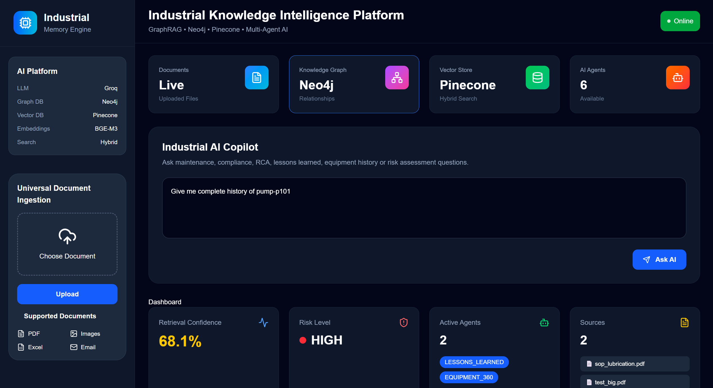
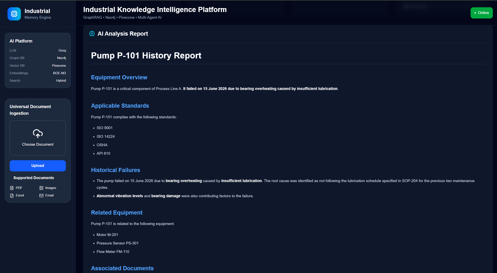
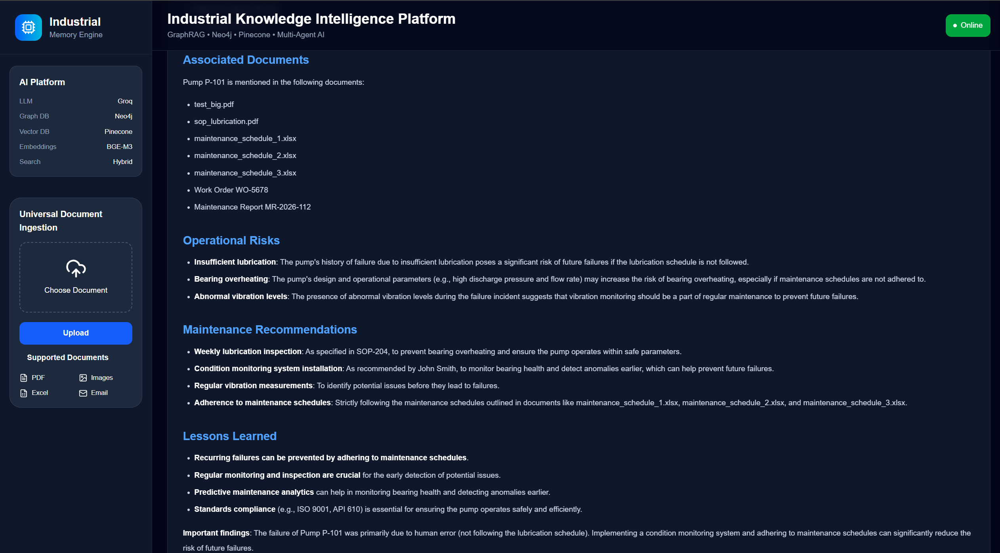
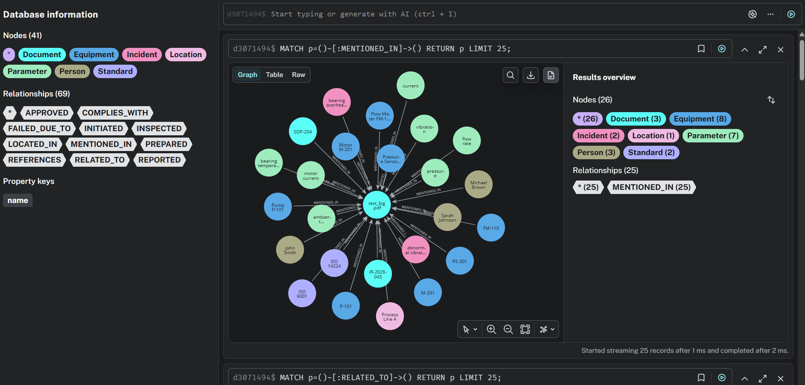

# Industrial Memory Engine

## Problem

Knowledge fragmentation and loss of operational expertise in industrial organizations.

## Solution

AI-powered memory graph that preserves operational knowledge and provides maintenance and compliance intelligence.

## 🎥 Demo

[](https://www.youtube.com/watch?v=d13sjbFJPh0)

**▶ Watch the full project demonstration**









## Universal Industrial Knowledge Intelligence Platform

Industrial Memory Engine is an AI-powered industrial knowledge intelligence platform that transforms fragmented industrial documents into connected, searchable, and actionable knowledge.

It combines **GraphRAG, Knowledge Graphs, Hybrid Search, Multi-Agent AI, and LLMs** to help users understand equipment history, failures, compliance, operational risks, maintenance records, and lessons learned.

> From industrial documents to connected intelligence.

## 🚀 Key Features

- **Universal Document Ingestion** — PDF, Excel, images, and email/MSG files.
- **OCR** — EasyOCR for image-based documents when required.
- **Knowledge Graph** — Neo4j stores industrial entities and relationships.
- **Hybrid Search** — Dense semantic retrieval + BM25 sparse keyword retrieval.
- **GraphRAG** — Combines vector retrieval with Knowledge Graph context.
- **Multi-Agent AI** — Router Agent directs requests to specialized capabilities.
- **Industrial AI Reports** — Equipment history, standards, failures, risks, recommendations, and lessons learned.
- **AI Copilot** — Natural-language interface for industrial knowledge discovery.

## 🏗️ Architecture

```text
Industrial Documents
(PDF / Excel / Image / Email)
            |
            v
     Universal Parser
            |
            v
     Text Extraction
            |
            v
        Chunking
       /        \
      v          v
 Embeddings   Entities &
      |        Relations
      v          |
   Pinecone     Neo4j
      \          /
       \        /
        v      v
      GraphRAG
        |
        v
   Context Fusion
        |
        v
     Groq LLM
        |
        v
 Industrial AI Report
```

### Query Flow

```text
User Query
    |
    v
Router Agent
    |
    +--> Dense Retrieval ----+
    |                        |
    +--> BM25 Retrieval -----+--> Hybrid Context
                             |
                             v
                      Neo4j Graph Context
                             |
                             v
                        GraphRAG Fusion
                             |
                             v
                          Groq LLM
                             |
                             v
                    Evidence-backed Answer
```

## 🛠️ Technology Stack

| Layer | Technology |
|---|---|
| Frontend | React + Tailwind CSS |
| Backend | FastAPI |
| AI Framework | LangChain |
| LLM | Groq |
| Vector Database | Pinecone |
| Sparse Retrieval | BM25 |
| Knowledge Graph | Neo4j |
| Embeddings | HuggingFace `all-MiniLM-L6-v2` |
| OCR | EasyOCR |
| PDF Processing | PyMuPDF |
| Excel Processing | pandas / openpyxl |
| Email Processing | extract-msg |
| Deployment | Docker |

## 📁 Project Structure

```text
industrial-memory-engine/
├── backend/
│   ├── app/
│   ├── uploads/
│   ├── requirements.txt
│   ├── Dockerfile
│   └── .env
├── frontend/
│   ├── src/
│   ├── public/
│   ├── Dockerfile
│   └── .env
├── docker-compose.yml
├── .gitignore
└── README.md
```

## ⚙️ Environment Variables

Create `backend/.env`:

```env
PINECONE_API_KEY=your_pinecone_api_key
PINECONE_INDEX=your_pinecone_index
HF_TOKEN=your_huggingface_token
GROQ_API_KEY=your_groq_api_key

NEO4J_URI=your_neo4j_uri
NEO4J_USERNAME=your_neo4j_username
NEO4J_PASSWORD=your_neo4j_password
NEO4J_DATABASE=your_neo4j_database
```


## 🐳 Run with Docker

Make sure Docker Desktop is running.

From the project root:

```bash
docker compose up --build
```

Typical local endpoints:

```text
Frontend: http://localhost:5173
Backend:  http://localhost:8000
Neo4j:    http://localhost:7474
Bolt:     bolt://localhost:7687
```

Stop the application:

```bash
docker compose down
```

Rebuild after code or dependency changes:

```bash
docker compose up --build
```

## 🔎 Hybrid Retrieval

The project combines semantic and keyword retrieval:

```python
PineconeHybridSearchRetriever(
    embeddings=embeddings,
    sparse_encoder=bm25_encoder,
    index=index
)
```

Dense retrieval helps identify semantically related content, while BM25 preserves exact industrial terminology such as equipment IDs, standards, component names, and maintenance codes.

## 🕸️ Knowledge Graph

Neo4j represents industrial entities and relationships.

Example:

```text
Pump P-101
   |
   +-- RELATED_TO ------> Motor M-201
   |
   +-- MENTIONED_IN ----> Maintenance Report
   |
   +-- FAILED_DUE_TO ---> Insufficient Lubrication
   |
   +-- COMPLIES_WITH ---> ISO 9001
   |
   +-- LOCATED_IN ------> Process Line A
```

## 🤖 Multi-Agent Architecture

The Router Agent analyzes the user's request and routes it to the appropriate capability.

Example capabilities include:

- Maintenance Intelligence
- Compliance Analysis
- Risk Assessment
- Lessons Learned
- Equipment Intelligence

This modular design makes it easier to add new industrial agents in the future.

## 💬 Example

User query:

```text
Give me the complete history of Pump P-101.
```

The system can connect:

- Equipment records
- Maintenance reports
- SOPs
- Historical incidents
- Excel maintenance schedules
- Related equipment
- Standards

and generate a structured report containing:

- Equipment Overview
- Applicable Standards
- Historical Failures
- Related Equipment
- Associated Documents
- Operational Risks
- Maintenance Recommendations
- Lessons Learned


## 🚀 Deployment

The application is containerized with Docker:

```text
Frontend
   |
   v
FastAPI Backend
   |
   +--> Pinecone
   +--> Neo4j
   +--> Groq
   +--> HuggingFace
```

## 📈 Future Roadmap

- Predictive Maintenance
- IoT Sensor Integration
- Digital Twin Integration
- Voice-based Industrial Assistant
- Real-time Equipment Alerts
- SAP / Enterprise System Integration
- Autonomous AI Engineers

## 🎯 Why Industrial Memory Engine?

Traditional document search asks:

> Which document contains this information?

Industrial Memory Engine aims to answer:

> What does all of our connected industrial knowledge tell us about this problem?

By combining documents, hybrid retrieval, a Knowledge Graph, GraphRAG, multi-agent AI, and an LLM, the platform creates a connected intelligence layer for industrial knowledge.


## ⭐ Vision

**From documents to intelligence.  
From information to impact.**

